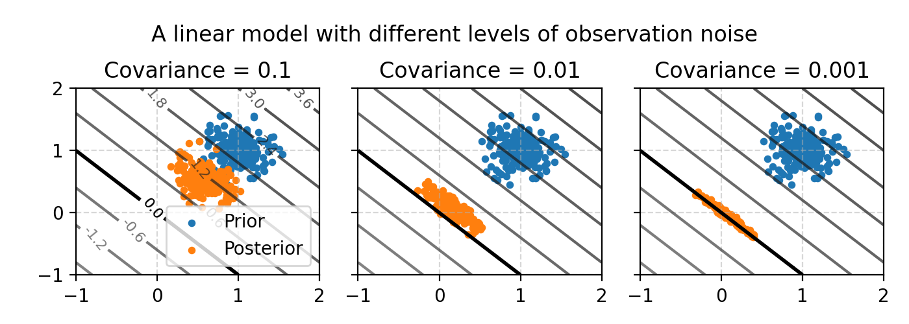
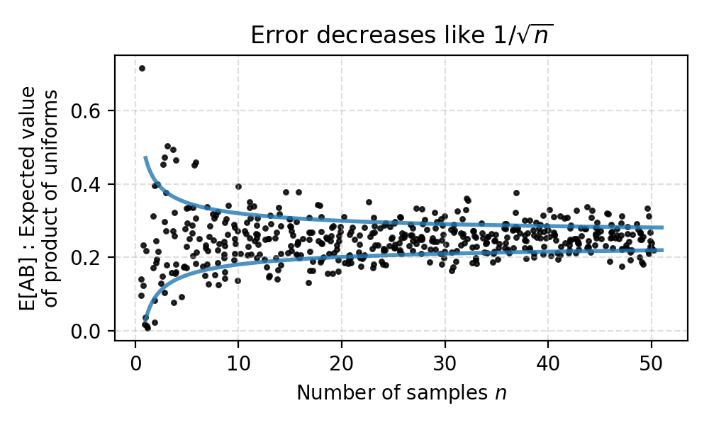
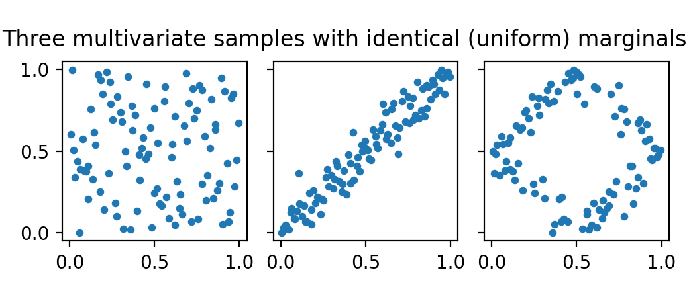
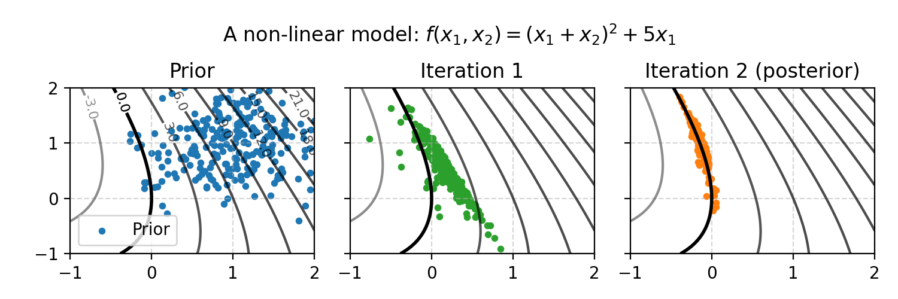
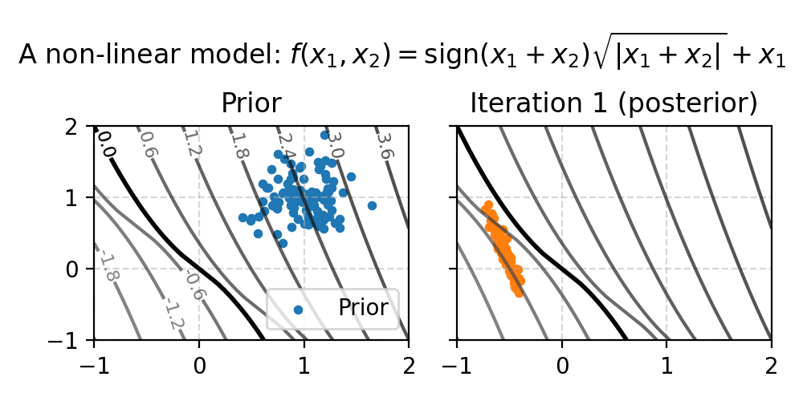
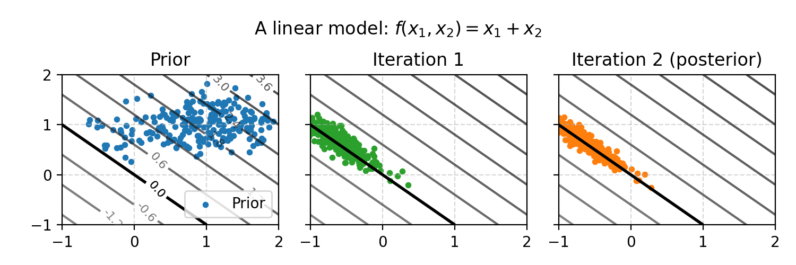
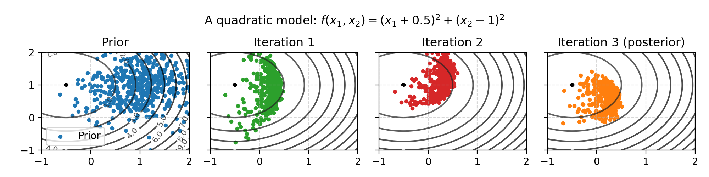

# Assumptions and limitations

Data assimilation algorithms like ES (Ensemble Smoother) and ESMDA (Ensemble Smoother with Multiple Data Assimilation) are used in complicated domains such as atmospheric physics and petroleum reservoirs.
This might lead you to believe that they are complex, sophisticated algorithms that work well on a wide variety of problems.
The opposite is true: they are very simple and impose extremely restrictive assumptions.
Practitioners should know how ESMDA works have an an intuition for how it fails.
Although the assumptions used to derive ES and ESMDA are never met in practice, the algorithms are still useful.

As a reminder, the problem that ESMDA solves is this: given a prior over model parameters as well as observed outcomes, adjust the prior in the direction of the observed outcomes.
This is a bit like optimization ("which inputs would produce these outputs?"), but ESMDA aims to capture uncertainty and mix the prior with the observations to obtain a posterior.

## Lesson 1: The algorithms are simple because the models are complex

MCMC (Markov Chain Monte Carlo) is used in most statistical applications where the goal is to sample a posterior distribution.
This is state of the art, but in geology we use ES and ESMDA, not MCMC.
How come?

The reason is that since the models are complex (slow to evaluate and black-box), the method must remain simple for the overall inference to have any chance of success:

- Most statistical models are fast to evaluate, a reservoir simulator is slow
- Most statistical models are differentiable, while a reservoir simulator is not (it is considered "black-box")

Algorithms like ES an ESMDA are simple in the sense that their theoretical foundation rests on an assumption that is never met in reality: a Gauss-Linear model.
Both of the assumptions (1) linearity of the model $`f`$ and (2) Gaussian noise are untrue in practice.

The figure below shows the Gauss-linear case, where the ESMDA solution corresponds to the theoretical solution in the limit of many samples (realizations).

In this example, two inputs (parameters) go into the model $`f`$ and there is one output.
Several inputs could produce the observed value (black line).
ES (one iteration of ESMDA) moves the prior toward the parameter configuration that explains the observed values.
The size of the movement here depends on the observation noise, which is an algorithm parameter.
In the rest of this document we'll set the observation noise to a low number.

## Lesson 2: Few samples lead to uncertain results

In most statistical models it's common to draw 1000 or even 10,000 samples (realizations) from the posterior distribution.
In reservoir models each function evaluation (running the simulator) is expensive, so we have to make do with far fewer samples.

This can be an issue even in small, simple problems:
Suppose $`A`$ and $`B`$ are two uniform variables.
What is the expected value of their product, i.e., $`\mathbb{E}[AB]`$ ?

The answer is 1/4, and if we use 25 samples to estimate this quantity we get 0.266 on the first try.
Pretty good!
However, if we re-seed the random number generator and try again we get 0.200 as the result.
A third seed produces 0.239, a fourth seed 0.226, etc.

With less than 25 samples the results are even worse.
In fact, the uncertainty (standard deviation) decreases asymptotically like $`1/\sqrt{n}`$, where $`n`$ is the number of samples.
The asymptotic result holds for _any_ quantity that you wish to estimate, but the constant differs depending on exactly what quantity you estimate.
In the book Statistical Rethinking (section 9.5.1), McElreath writes:

> If all you want are posterior means, it doesn't take many samples at all to get very good estimates.
> Even a couple hundred samples will do.
> But if you care about the exact shape in the extreme tails of the posterior, the 99th percentile or so, then you'll need many more.

McElreath says a few hundred will do, and in most books and papers at least a thousand samples are used.
The figure below shows the estimation of $`\mathbb{E}[AB]`$ as a function of the number of samples.
Each done is one simulation study using $`n`$ samples.

Even if ES and ESMDA were perfect algorithms that correctly sampled the posterior (they are not), we would still be bound by this law of statistics.

## Lesson 3: Marginal distributions hide high-dimensional information

Summary statistics like the expected value summarize information by collapsing samples to a single value.
One remedy is to plot and inspect all samples, using for instance a histogram.

However, histograms do not tell us anything about high dimensional phenomena such as correlations or other structure.
The figure below shows three data set with identical marginals (therefore also identical summary statistics: mean, standard deviation, etc.).

Plotting only reveals relationships in one dimension and two dimensions.
In high dimensions it is hard to study the relationships between variables.

## Lesson 4: ESMDA tends to deal with non-linearities better than ES

Above we saw that ES and ESMDA are derived from the Gauss-linear case.
The idea behind ESMDA is that several iterations can help deal with non-linearities.

Here is a weakly non-linear problem is two dimensions.
The first iteration takes us part of the way to the posterior, and the second iteration takes us closer.
The true, analytical posterior is the intersection between the black line and the gaussian represented by the samples.

The first iteration above only takes us part-way because when we linearize a quadratic function, the linear approximation is a lower bound (the function is convex).
With a concave function, such as a square-root, the opposite phenomenom occurs: ESMDA overshoots it the first iteration and corrects in the second.

In the figure above we observe that the posterior we obtain does not match the analytical answer.
The analytical answer is the intersection between the black line and the gaussian represented by the samples.
ESMDA places samples too high up on the line, while the true posterior has more probability around the bendy part of the black line.
The reason is that ESMDA has a propensity to move along the major covariance axes in each iteration, so in the second iteration it prefers to move up.
More on this in the next lesson!

## Lesson 5: The update direction is determined by gradient, covariance and more

In all examples above, ESMDA behaves a bit like optimization because it follows the gradient.
However, ESMDA is not an optimization algorithm and should not be thought of as such.
If we were solving an optimization problem we would not use ESMDA: optimization routines are better for optimization (duh!) - sampling a 2D function hundreds of times to optimize it should not be needed.

ESMDA uses gradients, but it is also influenced by the covariance in the current ensemble members (the samples).
This is shown in the figure below, where the update does not go to the origin (which is the point on the line closest to the prior mean).
This result matches the theoretical posterior distribution (this problem is Gauss-linear and ESMDA solves it correctly).

## Lesson 6: Updates can oscillate, and more iterations is not always better

Even on simple non-linear problems, ESMDA can produce embarressingly bad posteriors.
After one iteration the spherical samples below contract to an ellipse, which influences the update direction.
This produces oscillations that lead to posterior estimates that are worse (in expected value) for some parameters compared to what we began with.
By tweaking parameters it's possible to produce strong oscillations, even in two dimensions with very many samples.
Adding observation noise can help mitigate this effect by regularizing the updates, but at the cost of using a model we might not believe in.

In short, even with hundreds of samples on a 2D problem that is a simple quadratic, running ESMDA can be worse than not running it.

## Lesson 7: In high dimensions, everything is worse

So far we studied two dimensions, with hundreds of samples.
We've seen that on even weakly non-linear problems ESMDA produces posterior samples that are not correct.
We've seen that running several iterations can help on non-linear problems, but it can also be worse than running a single iteration.

In high dimensions, when the ratio of samples to dimensions is low, everything is worse:

- The samples are likely ellipse-like (randomly correlated) in some direction, because there are so many directions. This means ESMDA favors updates in those random directions.
- Estimating the gradient, which ESMDA implicitly does when it computes cross-covariance, becomes harder.

Both of these is due to spurious correlations.
In addition to this, more parameters means more chance that some of the samples from the prior distributions do not match the theoretical distributions.

### A high-dimensional, linear problem

In high dimensions, we cannot visualize ESMDA any longer.
To set the stage, we create a 100-dimensional linear problem $`f(x_1, x_2, x_3, \ldots) = \sum_{i=1}^{100} x_i`$, observe $`y=0`$ and place a prior on $`x_i \sim N(\mu=1, \sigma=0.3)`$.

Then we count how many parameters improve, across 1000 experiments with different seeds:

|   realizations |   percent_moved_in_correct_direction |   posterior_distance_over_prior_distance |
|---------------:|-------------------------------------:|-----------------------------------------:|
|             10 |                                 0.23 |                                     3.5  |
|             25 |                                 0.37 |                                     2.07 |
|             50 |                                 0.52 |                                     1.41 |
|            100 |                                 0.69 |                                     0.98 |
|            200 |                                 0.85 |                                     0.69 |
|            500 |                                 0.98 |                                     0.44 |
|           1000 |                                 1    |                                     0.31 |

A parameter is moved in the correct direction if its ESMDA posterior mean is closer to the true posterior mean than the ESMDA prior mean was.
Note that the prior mean is subject to sampling randomness too: the mean of the normal distribution we sample from is not always close to the mean of the samples.

The posterior distance over the prior distance measures if the mean moves closer to the true posterior.

In summary:

- With 50 realizations we have a 50% chance of improving parameters by running ESMDA on this simple, linear example.
- With 100 realizations we have a 50% chance of the posterior mean moving in the correct direction.

More iterations will not help either: with three ESMDA iterations the results are more or less exactly the same.

### A high-dimensional, quadratic problem

We create a 100-dimensional quadratic problem $`f(x_1, x_2, x_3, \ldots) = \sum_{i=1}^{100} x_i^2`$, observe $`y=0`$ and place a prior on $`x_i \sim N(\mu=1, \sigma=0.3)`$.

Here are the results from running a single ESMDA iteration:

|   realizations |   percent_moved_in_correct_direction |   posterior_distance_over_prior_distance |
|---------------:|-------------------------------------:|-----------------------------------------:|
|             10 |                                 0.42 |                                     1.86 |
|             25 |                                 0.61 |                                     1.17 |
|             50 |                                 0.74 |                                     0.87 |
|            100 |                                 0.84 |                                     0.71 |
|            200 |                                 0.92 |                                     0.61 |
|            500 |                                 0.99 |                                     0.55 |
|           1000 |                                 1    |                                     0.52 |

With three iterations the results are worse, not better:

|   realizations |   percent_moved_in_correct_direction |   posterior_distance_over_prior_distance |
|---------------:|-------------------------------------:|-----------------------------------------:|
|             10 |                                 0.12 |                                     6.94 |
|             25 |                                 0.39 |                                     2    |
|             50 |                                 0.67 |                                     1.01 |
|            100 |                                 0.84 |                                     0.7  |
|            200 |                                 0.89 |                                     0.64 |
|            500 |                                 0.88 |                                     0.65 |
|           1000 |                                 0.93 |                                     0.59 |

## Summary

ESMDA and ES are pretty simple algorithms: the crudely move realizations in one direction, attempting to balance the prior with the observations.
The algorithm is derived for the Gauss-linear case, and only holds in the limiting case of many samples.
Furthermore, anything that is not Gaussian and linear comes with absolutely no guarantees.

Visually we have seen that ESMDA does manage to crudely deal with some simple non-linearities (weakly non-linear, quadratic) problems in some sense.
But we have also seen that it does not solve 2D non-linear problems, even with hundreds of samples or unlimited number of ESMDA iterations.
No 2D problem shown here had posteriors that matched the analytical ones (expect the linear problems).
In high dimensions another set of issues crop up and confound the understanding of the algorithm.
Since a reservoir simulator is most certaintly non-linear, with multiple minima, very high dimensional, etc - great care should be taken so that we do not end up studying random noise.

