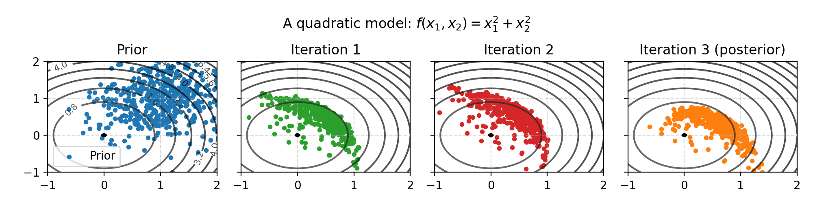

# Assumptions and limitations

Data assimilation algorithms like ES (Ensemble Smoother) and ESMDA (Ensemble Smoother with Multiple Data Assimilation) are used in complicated domains such as atmospheric physics and petroleum reservoirs.
This might lead you to believe that they are very complex and sophisticated algorithms that can deal with a wide variety of problems.
However, in a sense the exact opposite is true: they are very simple and impose extremely restrictive assumptions.
They are still useful, and in practice assumptions do not need to be met to use the algorithm.
Still, practitioners should know how these algorithms work have an an intuition for how they fail.

As a reminder, the problem that ESMDA solves is this: given a prior over model parameters and observed outcomes, adjust the prior in the direction of the observed outcomes.
This is a bit like optimization ("which inputs would produce these outputs?"), but ESMDA aims to capture uncertainty and mix the prior with the observations to obtain a posterior.

## Lesson 1: The algorithms are simple because the models are complex

In most statistical applications, we combine priors with observed data using MCMC (Markov Chain Monte Carlo).
This is the state of the art, but reservoir models we use algorithms like ES and ESMDA, not MCMC.
How come?

The reason is that since the models are complex (slow to evaluate and black-box), the method must remain simple for the overall inference to remain tractable:

- Most statistical models are fast to compute, a reservoir simulator is slow
- Most statistical models are differentiable, while a reservoir simulator is not (it is considered a "black-box")

Algorithms like ES an ESMDA are simple in the sense that their theoretical foundation rests on an assumption that is never met in reality: a Gauss-Linear model.
Both of the assumptions (1) linearity of the model $`f`$ and (2) Gaussian noise are wildly untrue.

The figure below shows the Gauss-linear case, where the ESMDA solution corresponds to the theoretical solution.

In this example, there are two inputs into the model $`f`$ and one output.
Here several inputs could produce the output (black line).
Depending on the observation noise, ES (one iteration of ESMDA) moves the prior towards the parameter configuration that explains the observed values.

## Lesson 2: Few samples lead to uncertain results

In most statistical models it's common to draw 1000 or even 10,000 samples (realizations) from the posterior distribution.
In reservoir models each function evaluation (running the simulation) is expensive, so we have to make do with far fewer samples.

This can be an issue even in small, simple problems.
Suppose $`A`$ and $`B`$ are two uniform variables.
What is the expected value of their product, i.e., $`\mathbb{E}[AB]`$ ?

The answer is 1/4, but if we use 25 samples to estimate this quantity we get 0.266 on the first try.
Pretty good.
However, the next seed in the random number generator produces 0.200 as the result.
A third seed 0.239, a fourth seed 0.226.

With less than 25 samples the results are generally even worse.
In fact, the uncertainty (standard deviation) decreases asymptotically like $`1/\sqrt{n}`$, where $`n`$ is the number of samples.
The asymptotic result holds for _any_ quantity that you wish to estimate, but the constant differs depending on exactly what quantity you estimate.
In the book Statistical Rethinking (section 9.5.1) McElreath writes:

> If all you want are posterior means, it doesn't take many samples at all to get very good estimates.
> Even a couple hundred samples will do.
> But if you care about the exact shape in the extreme tails of the posterior, the 99th percentile or so, then you'll need many more.

McElreath says a few hundred will do, and in most books and papers at least a thousand samples are used.
The figure below shows the estimation of $`\mathbb{E}[AB]`$ as a function of the number of samples.
Each done is one simulation study using $`n`$ samples.

## Lesson 3: Marginal distributions may hide a lot of information

Summary statistics like the expected value (mean) hide information in the distribution by collapsing all the samples to a single value.
One remedy is to plot and inspect the samples, using for instance a histogram.
This solves the case with one variable.

If you have several variables, then a correlation matrix can similarily collapse the multivariate samplse to a single matrix.
However, this also hides a lot of information, because as [Anscombe's quartet](https://en.wikipedia.org/wiki/Anscombe%27s_quartet) and the [Datasaurus](https://www.research.autodesk.com/app/uploads/2023/03/same-stats-different-graphs.pdf_rec2hRjLLGgM7Cn2T.pdf) shows us, there are many ways to produce a correlation number.

The figure below shows three data set with identical marginals (therefore also identical summary statistics:mean, standard deviation, etc.).

Plotting only reveals relationships in one dimension and two dimensions.
In high dimensions it's impossible to visually study the relationships between variables.

## Lesson 4: ESMDA tends to deal with non-linearities better than ES

Above we saw that ES and ESMDA are derived from the Gauss-linear case.
The idea behind ESMDA is that several iterations can help deal with non-linearities.

Here is a weakly non-linear problem is two dimensions.
The first iteration takes us part-way to the posterior (black line), and the second iteration takes us closer.

The first iteration above takes us half-way because when we linearize a quadratic function, the linear approximation is a lower bound (the function is convex).
With a concave function, such as a square-root, the opposite phenomenom occurs: ESMDA overshoots it the first iteration and corrects in the second.

## Lesson 5: The update direction is determined by gradient and covariance

In all examples above, ESMDA behaves a bit like optimization because it follows the gradient.
However, if we were solving an optimization we would not use ESMDA: optimization routines are better and would produce better results - sampling a 2D function hundreds of times to optimize it should not be needed.

However, ESMDA is also influenced by the covariance in the current ensemble members (the samples).
This is shown in the figure below, where the update does not go to the origin (which is the point on the line closest to the prior mean).
This is in line with the theoretical posterior distribution, which as we have pointed out several times corresponds to ESMDA in the Gauss-linear case.

## Lesson 6: The updates can oscillate, and more iterations is not always better

Even on the simplest of problems that are non-linear, ESMDA can produce embarresingly bad posteriors.
After one iteration the sphere contracts to an ellipse, which influences the update direction.
This produces oscillations that lead to posterior estimates that are worse (in the expected value) than what we began with.
By tweaking parameters it's possible to produce strong oscillations, even in two dimensions with very many samples.
Adding observation noise can help mitigate this effect by regularizing the updates, but at the cost of using a model we might not believe in.

## Lesson 7: 

In high dimensions with few samples, almost every random sample is ellipse-like.

