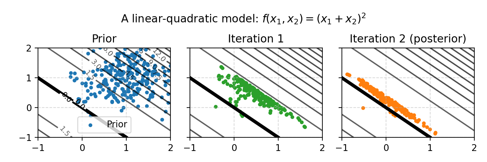

# Assumptions and limitations

This document highlights some inherit limitations when working with ESMDA by studying low-dimensional examples that can be visualized.
The goal is to give an intuition for how ESMDA works, and perhaps more importantly: showcase some of its limitations.

Data assimilation algorithms like ES (Ensemble Smoother) and ESMDA (Ensemble Smoother with Multiple Data Assimilation) are used in complicated domains such as atmospheric physics and petroleum reservoir modeling.
This might lead some to believe that they are complex, sophisticated algorithms that work well on a wide variety of problems.
The opposite is true: they are in many ways quite simple and they impose restrictive assumptions.
Although the assumptions used to derive ES and ESMDA are never met in practice, the algorithms are still useful.

As a reminder, the problem that ESMDA solves is this: given a prior over model parameters as well as observed outcomes, adjust the prior in the direction of the observed outcomes.
In other words, the goal is to approximate the posterior distribution, given a prior as described by sampled realizations and an observation.

## The algorithms are simple because the models are complex

MCMC (Markov Chain Monte Carlo) is used in most statistical applications where the goal is to sample a posterior distribution.
This is state of the art, but in petroleum reservoir modeling we use ES and ESMDA, not MCMC.
How come?

The reason is that since the models are complex (slow to evaluate, black-box, many parameters), the method must remain simple for the overall inference to have any chance of success:

- Most statistical models are fast to evaluate, a reservoir simulator is slow
- Most statistical models are differentiable, while a reservoir simulator is not (it is considered black-box)

Algorithms like ES an ESMDA are simple in the sense that their theoretical foundation rests on an assumption that is never met in reality: a Gauss-Linear model.
Both of the assumptions (1) linearity of the model $`f`$ and (2) Gaussian noise are unmet in practice.

The figure below shows the Gauss-linear case, where the ESMDA solution corresponds to the theoretical solution in the limit of many samples (realizations).


In this example, two inputs (parameters) go into the model $`f(x_1, x_2) = x_1 + x_2`$ and there is one output.
Several inputs could produce the observed value $`f(x_1, x_2) = 0`$ (black line).
ES (one iteration of ESMDA) moves the prior toward the parameter configuration that explains the observed value $`0`$.
The size of the movement depends on the observation noise, which is an algorithm parameter.
In the rest of this document we'll set the observation noise to a low number.

## Using samples to describe distributions

### Few samples lead to uncertain results

In most statistical models it's common to draw 1000 or even 10,000 samples (realizations) from the posterior distribution.
In reservoir models each function evaluation (running the simulator) is expensive, so we have to make do with far fewer samples.

This can be an issue even in small, simple problems:
Suppose $`A`$ and $`B`$ are two uniform variables with distribution $`U(0, 1)`$.
Suppose we want to compute the expected value of their product, i.e., $`\mathbb{E}[AB]`$.

The theoretical answer is 1/4. 
We can compute a Monte Carlo answer by drawing 25 samples from each distribution, multiplying them together, and computing the mean value.
If we do this with 25 samples, we get 0.266 on the first try.
That's a pretty good approximation!
However, if we re-seed the random number generator and try again we get 0.200 as the result.
A third seed produces 0.239, a fourth seed 0.226, etc.

With less than 25 samples the results are even worse.
In fact, the uncertainty (standard deviation) decreases asymptotically like $`1/\sqrt{n}`$, where $`n`$ is the number of samples.
The asymptotic result holds for _any_ quantity that we wish to estimate, but the constant differs depending on exactly what quantity we estimate.
In the book Statistical Rethinking (section 9.5.1), McElreath writes:

> If all you want are posterior means, it doesn't take many samples at all to get very good estimates.
> Even a couple hundred samples will do.
> But if you care about the 99th percentile, then you'll need many more.

McElreath says a few hundred will do, and in most books and papers at least a thousand samples are used.
The figure below shows the estimation of $`\mathbb{E}[AB]`$ as a function of the number of samples.
Each dot is one simulation study using $`n`$ samples.


The lesson is that whether we compute simple quantities such as $`\mathbb{E}[AB]`$, or high-dimensional distributions with ESMDA, we are still bound by this law of statistics: samples have inherit variability and we need four times as many samples to get twice as good results (due to the square root relationship).

### Marginal distributions hide high-dimensional information

Summary statistics like the expected value summarize information by collapsing many samples to a single value.
To inspect the distribution, we can plot all the samples with a histogram.

However, histograms do not tell us anything about high dimensional phenomena such as correlations or other structure.
The figure below shows three data set with identical marginals (therefore also identical summary statistics: mean, standard deviation, etc.), but very different joint distributions.


Plotting only reveals relationships in one or two dimensions.
High-dimensional relationships can be hard to understand when looking at variables one-at-a-time, or even two-at-a-time.

## The ensemble smoother

### ESMDA tends to deal with non-linearities better than ES

Above we saw that ES and ESMDA are derived from the Gauss-linear case.
The idea behind ESMDA is that several iterations can help deal with non-linearities.

Here is a weakly non-linear problem in two dimensions.
The first iteration takes us part of the way to the posterior, and the second iteration takes us closer.

What is the true, analytical posterior in this case?
The samples are drawn from a 2D gaussian, and this defines the prior distribution.
The observations are defined by the black line $`f(x_1, x_2)=0`$, and we assign very low noise to these samples.
The posterior is therefore the 2D gaussian evaluated on the black line.
This is the region of parameter space that aligns both with the prior and with the observations.
Imagine walking over a mountain (the 2D gaussian) on a path (the black line), and at each step measuring the height (probability density): the height as a function of the coordinates $`(x_1, x_2)`$ gives the probability density at each point.


The first iteration above only takes us part-way because when we linearize a quadratic function, the linear approximation is a lower bound (the function is convex).
This phenomenon is shown in the figure below:



With a concave function, such as a square-root, the opposite phenomenom occurs: ESMDA overshoots it the first iteration and corrects in the second.


In the figure above we observe that the posterior we obtain does not match the analytical answer exactly (again imagine walking on the path).
The analytical answer is the intersection between the black line and the gaussian represented by the samples.
ESMDA places samples too high up on the line (too far in the $`x_2`$-direction), while the true posterior has more probability mass around the bendy part of the black line.
ESMDA has a propensity to move along the major covariance axes in each iteration, so in the second iteration it prefers to move up.
More on this in the next section.

### The update direction is determined by gradient, covariance and more

In all examples above, ESMDA behaves a bit like a typical optimization algorithm (e.g. steepest descent) because the updates follow the gradient.
However, ESMDA is not exactly an optimization algorithm in the traditional sense: its goal is to move the samples toward the posterior while capturing the uncertainty, not determine a single point where $`f(x_1, x_2)=0`$.

ESMDA uses gradients implicitly, but it is also influenced by the covariance in the current ensemble members (the samples).
This is shown in the figure below, where the update does not go to the origin (which is the point on the line closest to the prior mean).
The posterior computed by ESMDA matches the theoretical posterior distribution, since the problem is Gauss-linear.


### Updates can oscillate, and more iterations is not always better

Even on simple non-linear problems, ESMDA can produce bad posteriors.
In the quadratic example below, the theoretical posterior is a point mass at the lowest point in the quadratic.

Observe that after one iteration the spherical samples contract to an ellipse, which influences the update direction in the next iteration.
This produces oscillations that lead to posterior estimates that are worse (in expected value) for some parameters compared to what we began with.
By tweaking parameters it's possible to produce strong oscillations, even in two dimensions with very many samples.
Increasing observation noise can help mitigate this effect by regularizing the updates, but at the cost of using a model we might not believe in.


In short, even with hundreds of samples on a 2D problem that is quadratic, running ESMDA can be worse than not running it.

### In high dimensions, everything is worse

Finally, let us study a high-dimensional example.
This is what ESMDA is used for, but unfortunately it's hard to visualize.

So far we've seen that on even weakly non-linear problems ESMDA produces posterior samples that are not correct in two dimensions.
We've seen that running several iterations can help on non-linear problems, but it can also be worse than running a single iteration.

In high dimensions, when the ratio of samples to dimensions is low, everything becomes more difficult:

- The samples are likely ellipse-like (randomly correlated) in some direction, because there are so many directions. This means ESMDA favors updates in those random directions.
- Estimating the gradient, which ESMDA implicitly does when it computes cross-covariance, becomes harder.

Both of these is due to _spurious correlations_, which we will discuss below.
In addition to this, more parameters means more chance that some of the samples from the prior distributions do not match the theoretical distributions.

#### A high-dimensional, linear problem

In high dimensions, we cannot visualize ESMDA any longer.
To set the stage, we create a 100-dimensional linear problem:

```math
f(\boldsymbol{x}) = \sum_{i=1}^{100} x_i
```

The analytical prior distribution is 
```math
x_i \sim N(\mu=1, \sigma=0.3)
```
and the observation is $`f(\boldsymbol{x}) = 0`$.
With low observation noise, which we assume, the posterior is the 100D gaussian projected onto the 99D plane defined by $`f(\boldsymbol{x}) = 0`$.
The true posterior mean is therefore zero in every parameter.

Now, when we sample $`x_i \sim N(\mu=1, \sigma=0.3)`$, the mean of the samples might not correspond to the analytical mean of the distribution.
For instance, one particular sample of 10 realizations gives `[1.09, 0.69, 1.23, 1.28, 0.41, 0.61, 1.04, 0.91, 0.99, 0.74]`, and the sampled mean is `0.899`, which is around 10% away from the analytical mean of `1`.
This leads to some error (but can be remedied in part by quasi monte carlo sampling such as latin hypercube sampling).

Furthermore, the correlations of the samples might not correspond to the analytical correlation of the distribution.
This phenomena is called spurious correlations.
For instance, if we draw 100 samples from a 100D gaussian, the median absolute correlation is `0.07` or so.
The largest correlation is `0.38`.
This is due to random chance in sampling.

Below we run 1000 experiments for each number of realizations and report two results:

- `percent_moved_in_correct_direction`: How many of the parameters $`x_i`$ have means that improve after running ESMDA?
  In other words, what is the probability that $`\mathbb{E}[x_i^{posterior}]`$ is closer to $`0`$ than $`\mathbb{E}[x_i^{prior}]`$? A higher number is better.
- `posterior_distance_over_prior_distance`: The prior distribution has a 100D mean value $`(\mathbb{E}[x_1^{prior}], \mathbb{E}[x_2^{prior}], \mathbb{E}[x_3^{prior}], \ldots)`$ and a distance from the origin (true posterior) $`(0, 0, 0, \ldots)`$ that we can compute. Similarily the posterior mean has a distance from the origin. What is the ratio of these distances? A lower number is better, and a number less than one means that posterior distance is closer to the true posterior than the prior distance was.

Since it is possible to improve individual variables while worsening the total distance, we report both metrics.

For instance:
```text
true_posterior = array([0., 0., 0., 0., 0., 0., 0., 0., 0., 0.])
prior          = array([1., 1., 1., 1., 1., 1., 1., 1., 1., 1.])
posterior      = array([1. , 1. , 1. , 1. , 1. , 1.5, 1.5, 0.5, 0.5, 0.5])
````
Here the posterior improves 3 variables and worsens 2.
Still, the total distance _increases_ from `3.16` to `3.20`.

Here are the results from the 100D example:

|   realizations |   percent_moved_in_correct_direction |   posterior_distance_over_prior_distance |
|---------------:|-------------------------------------:|-----------------------------------------:|
|             10 |                                 0.23 |                                     3.5  |
|             25 |                                 0.37 |                                     2.07 |
|             50 |                                 0.52 |                                     1.41 |
|            100 |                                 0.69 |                                     0.98 |
|            200 |                                 0.85 |                                     0.69 |
|            500 |                                 0.98 |                                     0.44 |
|           1000 |                                 1    |                                     0.31 |

- With 50 realizations we have a 50% chance of improving parameters by running ESMDA on this simple, linear example.
- With 100 realizations we have a 50% chance of the posterior mean moving in the correct direction.

More iterations will not help either: with three ESMDA iterations the results are more or less exactly the same.

#### A high-dimensional, quadratic problem

We create a 100-dimensional quadratic problem $`f(x_1, x_2, x_3, \ldots) = \sum_{i=1}^{100} x_i^2`$, observe $`y=0`$ and place a prior on $`x_i \sim N(\mu=1, \sigma=0.3)`$.

Here are the results from running a single ESMDA iteration:

|   realizations |   percent_moved_in_correct_direction |   posterior_distance_over_prior_distance |
|---------------:|-------------------------------------:|-----------------------------------------:|
|             10 |                                 0.42 |                                     1.86 |
|             25 |                                 0.61 |                                     1.17 |
|             50 |                                 0.74 |                                     0.87 |
|            100 |                                 0.84 |                                     0.71 |
|            200 |                                 0.92 |                                     0.61 |
|            500 |                                 0.99 |                                     0.55 |
|           1000 |                                 1    |                                     0.52 |


With three iterations the results are worse, not better:

|   realizations |   percent_moved_in_correct_direction |   posterior_distance_over_prior_distance |
|---------------:|-------------------------------------:|-----------------------------------------:|
|             10 |                                 0.12 |                                     6.94 |
|             25 |                                 0.39 |                                     2    |
|             50 |                                 0.67 |                                     1.01 |
|            100 |                                 0.84 |                                     0.7  |
|            200 |                                 0.89 |                                     0.64 |
|            500 |                                 0.88 |                                     0.65 |
|           1000 |                                 0.93 |                                     0.59 |


## Summary

ESMDA and ES are pretty simple algorithms: they crudely move realizations in one direction, attempting to balance the prior with the observations.
The algorithm is derived for the Gauss-linear case in the limiting case of many samples.
On any problem that is not Gaussian and linear, the algorithm comes with no guarantees.
This does not mean that the algorithm is not useful: in high dimensions with expensive functions, there are few alternatives.

Visually we have seen that ESMDA does manage to crudely deal with some simple non-linearities (weakly non-linear, quadratic) problems in some sense.
But we have also seen that it does not "solve" 2D non-linear problems, in the sense of always being close to the true posterior distribution, even with hundreds of samples or unlimited number of ESMDA iterations.
In fact, no 2D problem shown here had posteriors that matched the analytical ones (expect the linear problems).
In high dimensions another set of issues crop up and confound the understanding of the algorithm.
Since a reservoir simulator is most certaintly non-linear and very high dimensional, etc - care should be taken so that one does not end up studying random noise.